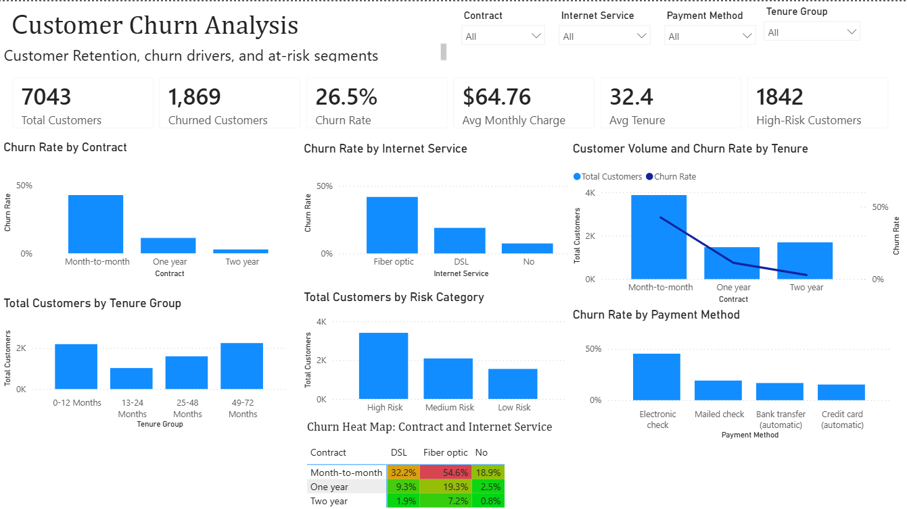
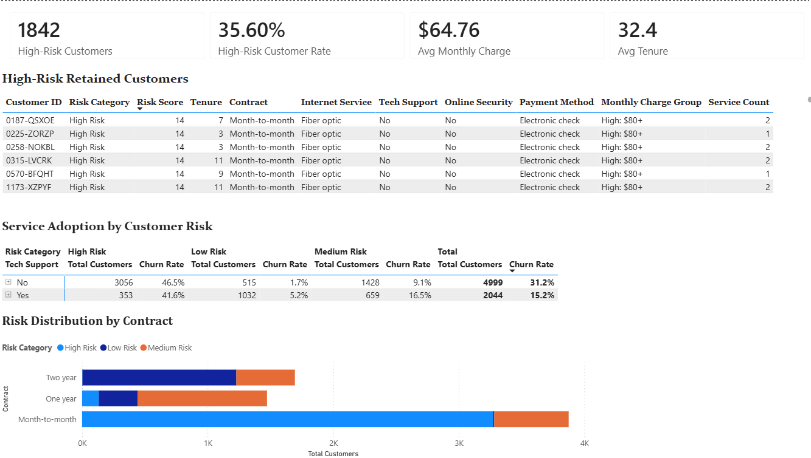
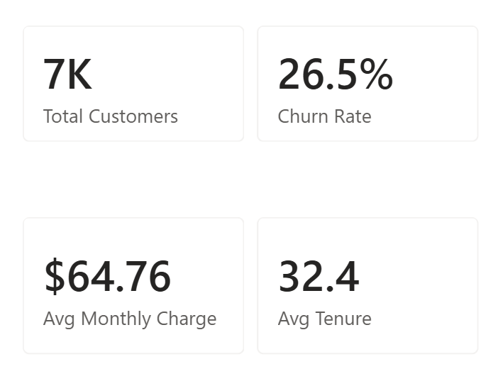

# Telco Customer Churn Analysis

## Power BI Customer Retention and Risk-Segmentation Dashboard


## Project Overview

Customer churn represents a significant challenge for telecommunications and subscription-based businesses. When customers leave, companies lose recurring revenue and may incur additional costs to replace those customers.

This project uses Power BI to analyze IBM's Telco Customer Churn dataset. The dashboard identifies major churn drivers, measures customer retention performance, and segments retained customers according to their estimated risk characteristics.

The purpose of the project is to demonstrate how customer account, service, billing, contract, and tenure data can be transformed into actionable business intelligence.

---

## Business Objective

The primary objective was to develop an interactive dashboard that helps business stakeholders:

- Measure overall customer churn and retention
- Identify customer groups with elevated churn rates
- Compare churn across contracts, internet services, and payment methods
- Examine the relationship between tenure and churn
- Segment customers using a rule-based risk score
- Identify retained customers who may require proactive retention efforts

---

## Dataset

The analysis uses the IBM Telco Customer Churn sample dataset distributed through Kaggle.

The original dataset contains:

- **7,043 customer records**
- **21 original columns**
- Customer demographic information
- Service-subscription information
- Account and contract information
- Billing and payment information
- Monthly and total charges
- Customer churn status

The `Churn` field is the target outcome and indicates whether a customer left the company.

**Dataset source:**  
https://www.kaggle.com/datasets/blastchar/telco-customer-churn

Additional source and attribution information is available in 📁 **[Dataset Source](Dataset/DatasetSource.md)**

---

## Tools and Technologies

- **Power BI Desktop** — dashboard development and data visualization
- **Power Query** — data cleaning and transformation
- **DAX** — calculated columns, measures, segmentation, and KPIs
- **Microsoft Excel/CSV** — source-data format
- **GitHub** — project documentation and portfolio presentation

---

## Data Preparation

The following data-preparation steps were completed before dashboard development:

1. Imported the Telco Customer Churn CSV into Power BI.
2. Reviewed column names and data types.
3. Standardized field names for readability.
4. Converted numeric fields to appropriate number formats.
5. Reviewed fields for blank or invalid values.
6. Created customer tenure groupings.
7. Created monthly-charge groupings.
8. Developed service-adoption calculations.
9. Created rule-based customer risk components.
10. Built measures for churn, retention, customer volume, tenure, and charges.

---

## Dashboard Pages

### 1. Executive Churn Dashboard

The executive dashboard provides a high-level view of customer churn and major churn drivers.

#### Primary KPIs

- Total Customers
- Churned Customers
- Churn Rate
- Average Monthly Charge
- Average Tenure
- High-Risk Customers

#### Analyses Included

- Churn rate by contract
- Churn rate by internet service
- Customer count and churn rate by contract
- Customer count by tenure group
- Customer count by risk category
- Churn rate by payment method
- Contract and internet-service churn heatmap
- Interactive filters for contract, internet service, payment method, and tenure



---

### 2. Customer Risk Analysis

The customer-risk page focuses on retained customers who display characteristics associated with elevated churn risk.

The page includes:

- High-risk customer count
- High-risk customer rate
- Average monthly charge
- Average customer tenure
- Detailed high-risk customer table
- Service adoption by customer-risk category
- Risk distribution by contract

The detailed customer table supports more targeted retention analysis by displaying information such as:

- Customer ID
- Risk category
- Risk score
- Tenure
- Contract type
- Internet service
- Tech support
- Online security
- Payment method
- Monthly-charge group
- Service count

  


---

### 3. KPI Tooltip

A custom report-page tooltip provides additional KPI context when users interact with dashboard visuals.

The tooltip displays:

- Total Customers
- Churn Rate
- Average Monthly Charge
- Average Tenure



---

## Customer Risk Methodology

A rule-based risk-scoring system was developed to classify customers according to selected churn-related characteristics.

Risk factors include:

- Short customer tenure
- Month-to-month contracts
- Lack of technical support
- Lack of online security
- Other selected service-adoption characteristics

Each factor contributes points to the customer's total risk score. Customers are then assigned to one of three categories:

- **High Risk**
- **Medium Risk**
- **Low Risk**

This score is an analytical segmentation created for the portfolio project. It should not be interpreted as a machine-learning prediction or as the exact probability that a customer will churn.

The DAX calculations are documented in [DAX Measures](Documentation/DAXMeasures.md)

---

## Key Findings

### 1. Contract type is strongly associated with churn

Month-to-month customers have the highest churn rate by a substantial margin. Customers with one-year and two-year contracts demonstrate considerably stronger retention.

**Business implication:**  
The company could test incentives that encourage month-to-month customers to move to longer-term agreements.

---

### 2. Fiber-optic customers have the highest churn rate

Customers using fiber-optic internet demonstrate a higher churn rate than DSL customers and customers without internet service.

**Business implication:**  
The company should investigate fiber-optic pricing, service reliability, customer expectations, and support experiences.

---

### 3. Electronic-check customers experience elevated churn

Electronic check is associated with the highest churn rate among the available payment methods.

**Business implication:**  
The payment method may act as a marker for customers who are less committed or have different account behaviors. Additional investigation would be required before assuming that the payment method directly causes churn.

---

### 4. Short-tenure customers require early retention attention

Customers in the earliest tenure groups are more vulnerable to churn than customers with longer relationships.

**Business implication:**  
Onboarding, first-year support, service education, and early customer-engagement programs may improve retention.

---

### 5. Support and security adoption may help identify risk

Customers without technical support or online security are heavily represented in higher-risk customer groups.

**Business implication:**  
The company could examine whether targeted service education, support bundles, or personalized outreach improve customer satisfaction and retention.

---

## Recommended Retention Actions

Based on the dashboard findings, the telecommunications company could consider:

1. Providing contract-upgrade incentives to selected month-to-month customers.
2. Creating first-year customer onboarding and engagement campaigns.
3. Reviewing fiber-optic service quality, complaints, pricing, and support performance.
4. Offering targeted technical-support and online-security trials.
5. Prioritizing high-risk retained customers for proactive outreach.
6. Testing automatic-payment incentives for appropriate customer groups.
7. Measuring retention-program outcomes through controlled experiments.

---

## DAX Examples

### Churn Rate

```DAX
Churn Rate =
DIVIDE(
    [Churned Customers],
    [Total Customers],
    0
)
```

### High-Risk Customers

```DAX
High-Risk Customers =
CALCULATE(
    [Total Customers],
    'Telco Customers'[Risk Category] = "High Risk"
)
```

### Tenure Risk Points

```DAX
Tenure Risk Points =
SWITCH(
    TRUE(),
    'Telco Customers'[Tenure] <= 12, 3,
    'Telco Customers'[Tenure] <= 24, 2,
    'Telco Customers'[Tenure] <= 48, 1,
    0
)
```


## Repository Structure

```text
Telco-Customer-Churn-Power-BI
│
├── Telco Customer Churn Dashboard.pbix
├── README.md
│
├── Dashboard Screenshots
│   ├── Executive Dashboard.png
│   ├── Customer Risk Analysis.png
│   └── KPI Tooltip.png
│
├── Documentation
│   ├── DAX Measures.md
│   └── Data Dictionary.md
│
└── Dataset
    └── Dataset Source.md
```

---

## How to View the Project

### Option 1: Review the dashboard screenshots

The dashboard screenshots can be viewed directly in this repository without installing Power BI.

### Option 2: Open the Power BI file

1. Download the `.pbix` file.
2. Install or open Microsoft Power BI Desktop.
3. Open `Telco Customer Churn Dashboard.pbix`.
4. Use the slicers and dashboard interactions to explore the analysis.

---

## Project Limitations

- The dataset is a public sample dataset and may not represent the current operations of a real telecommunications provider.
- The data does not include geographic regions, customer complaints, service outages, detailed usage, or competitor pricing.
- Relationships identified in the dashboard are associations and should not automatically be interpreted as causal.
- The risk score is rule based and was not validated as a predictive model.
- Retention recommendations should be tested before company-wide implementation.

---

## Future Enhancements

Potential future improvements include:

- Developing a machine-learning churn model
- Comparing model predictions with the rule-based risk score
- Adding customer-lifetime-value estimates
- Measuring potential revenue at risk
- Creating dynamic report titles
- Adding a dedicated retention-strategy page
- Testing alternative risk-scoring thresholds
- Adding cohort-based retention analysis
- Publishing the report through Power BI Service when appropriate

---

## Skills Demonstrated

- Business intelligence
- Customer churn analysis
- Power BI dashboard design
- Power Query transformation
- DAX measures
- Calculated columns
- Customer segmentation
- KPI development
- Conditional formatting
- Matrix heatmaps
- Drill-through analysis
- Report-page tooltips
- Business recommendations
- Data storytelling

---

## Author

**Wendy Alpizar**

Information and Decision Sciences graduate with a Finance minor from the University of Illinois Chicago.

Career interests:

- Business Analysis
- Data Analysis
- Business Intelligence
- Financial Analysis

---

## Acknowledgments

The original dataset is credited to IBM Sample Data Sets and its original authors. The data was accessed through Kaggle and used for educational and portfolio purposes.
